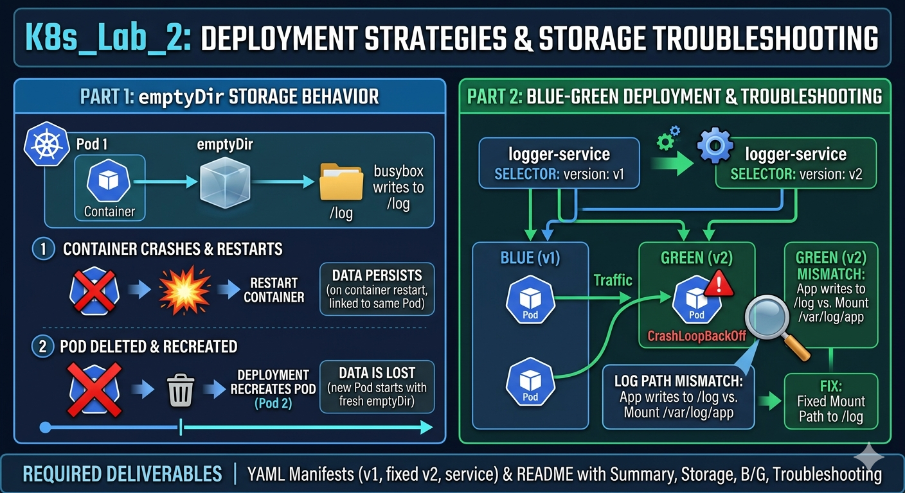

# Lab 4: Deployment Strategies and Storage Troubleshooting

## Lab Summary

In this lab, a logging application was deployed in the **staging namespace** using Kubernetes.
The application writes logs to a file every 10 seconds using a container based on the busybox image.

The lab demonstrates:

* Using **emptyDir** volumes for temporary storage
* Testing how storage behaves during container restarts and pod recreation
* Implementing a **Blue-Green deployment strategy**
* Troubleshooting a **CrashLoopBackOff** issue caused by an incorrect volume mount path

---

# Storage Behavior Explanation

## 1️⃣ Container Crash

When the container process crashes and Kubernetes restarts the container inside the **same pod**, the `emptyDir` volume **keeps its data**.

This means the log file `/log/output.txt` remains available after the container restart.

## 2️⃣ Pod Deletion

When the pod is deleted and recreated by the Deployment, the `emptyDir` volume is **deleted with the pod**.

A new pod is created with a **fresh emptyDir**, meaning the previous log data is lost.

---

# Blue-Green Deployment Steps

1. Deploy **logger version v1** with an `emptyDir` volume mounted at `/log`.

2. Create a **ClusterIP service** called `logger-service` selecting:

```
version: v1
```

3. Deploy **logger version v2** with two replicas and a modified logging command that includes the hostname.

4. Update the service selector from:

```
version: v1
```

to

```
version: v2
```

5. Verify that the service now routes traffic to the **v2 pods**.

---

# Troubleshooting

## Problem

One of the `logger-v2` pods entered the **CrashLoopBackOff** state.

## Cause

The `emptyDir` volume was mounted at:

```
/var/log/app
```

while the container command writes logs to:

```
/log/output.txt
```

Since the `/log` directory was not mounted, the container failed to write logs and repeatedly crashed.

## Diagnosis Commands

```
kubectl get pods -n staging
kubectl describe pod <pod-name> -n staging
kubectl logs <pod-name> -n staging
```

## Fix

The deployment manifest was updated so that the volume is mounted at the correct path:

```
/log
```

After reapplying the manifest, both `logger-v2` pods started running successfully.

---

# Commands Used

```
kubectl create namespace staging

kubectl apply -f manifests/v1/logger-deployment.yaml

kubectl get pods -n staging

kubectl exec -it <pod-name> -n staging -- sh

kill 1

kubectl delete pod <pod-name> -n staging

kubectl apply -f manifests/service/logger-service.yaml

kubectl apply -f manifests/v2/logger-deployment.yaml

kubectl patch service logger-service -n staging -p '{"spec":{"selector":{"version":"v2"}}}'

kubectl describe pod <pod-name> -n staging

kubectl logs <pod-name> -n staging

kubectl exec -it <v2-pod> -n staging -- sh
cat /log/output.txt
```

---

# Project Structure

```
Lab_4
│
├── README.md
│
└── manifests
    ├── v1
    │   └── logger-deployment.yaml
    │
    ├── v2
    │   └── logger-deployment.yaml
    │
    └── service
        └── logger-service.yaml
```

